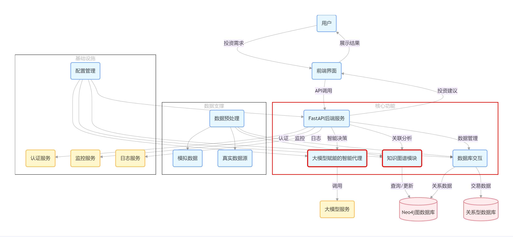

# 大模型赋能的智能股票投资助手

## Large-Model-Enabled-Intelligent-Stock-Investment-Assistant

## 项目简介

本项目是一个利用大模型技术实现的智能股票投资助手，旨在为投资者提供一站式的股票投资服务，包括股票数据查询、交易处理、风险评估、投资策略生成以及知识咨询等功能。通过整合多维股票数据、构建知识图谱挖掘公司间关联关系，结合大模型实现智能指令解析和策略生成，帮助投资者做出更科学、更明智的投资决策。

## 项目结构

```
stock-assistant/
├── main.py                # 主入口
├── agent/                 # 智能代理模块
│   ├── instruction_parser.py  # 指令解析，利用大模型判断用户指令类型
│   ├── transaction_agent.py   # 交易代理，处理买入和卖出等交易指令
│   ├── risk_assessment.py     # 风险评估，计算股票风险评分
│   ├── knowledge_agent.py     # 知识图谱查询，提供股票相关知识咨询
│   └── strategy_agent.py      # 策略生成，根据用户需求生成投资策略
├── api/                   # API接口
│   ├── stock_api.py         # 股票数据API，提供市场估值、实时行情等数据
│   └── transaction_api.py   # 交易API，执行实际的交易操作
├── knowledge_graph/       # 知识图谱模块
│   ├── kg_importer.py       # 知识图谱导入，将股票数据和供应链关系导入知识图谱
│   └── kg_query.py          # 知识图谱查询，实现股票基本信息和供应链关系查询
├── utils/                 # 工具模块
│   ├── config.py            # 配置文件，存储项目的配置信息，如API密钥、数据库连接信息等
│   └── logger.py            # 日志工具，记录项目运行过程中的日志信息
└── data/                  # 数据存储（模拟）
    └── mock_data.py        # 模拟数据生成，使用Faker库生成股票模拟数据
├── frontend/          # 前端模块
│   ├── login.html          # 登录页面
│   ├── register.html       # 注册页面
│   ├── trade.html          # 股票交易页面
│   ├── strategy.html       # 投资策略页面
│   ├── consult.html        # 股票咨询页面
│   ├── style.css           # 公共样式文件
│   └── app.js              # 公共逻辑文件
│   └── js/
│       ├── trade.js        # 处理股票交易页面的交互逻辑
│       ├── consult.js      # 处理股票咨询页面的交互逻辑
│       └── strategy.js     # 处理投资策略页面的交互逻辑
```

## 核心功能

### 1. 指令解析与分发

用户输入指令后，`InstructionParser` 利用大模型解析指令类型，将其准确分发给对应的代理模块进行处理。

### 2. 交易处理

`TransactionAgent` 解析交易指令，获取股票实时价格，进行风险评估，若风险过高则拒绝交易，否则执行买入或卖出操作。

### 3. 风险评估

`RiskAssessment` 通过计算股票的波动率、市值和价格趋势等指标，动态调整权重，评估股票的风险。

### 4. 策略生成

`StrategyAgent` 根据用户的策略指令，结合市场数据和知识图谱信息，选择合适的行业和推荐股票，构建提示词，调用大模型生成投资策略。

### 5. 知识查询

`KnowledgeAgent` 提供知识图谱查询功能，能够回答用户关于股票的各类咨询问题，如供应链关系查询、行业信息查询等。

### 6. 前端交互

前端页面提供用户注册、登录、股票交易、投资策略查询和股票咨询等功能，与后端接口进行交互，为用户提供良好的使用体验。

## 环境搭建

### 1. 安装依赖库

使用以下命令安装项目所需的依赖库：

```
pip install -r requirements.txt
```

- Python 3.8+
- 依赖库： requirements.txt （需手动生成，包含fastapi、py2neo、openai等）
- 环境变量： DEEPSEEK_API_KEY （用于LLM调用）

### 2. 配置文件设置

在 utils/config.py 中配置 API 密钥、数据库连接信息等。

## 项目运行

### 1. 启动后端服务

运行 backend.py 启动后端服务：

```
uvicorn backend:app --reload
```

### 2. 访问前端页面

访问前端页面：
打开 frontend_001/login.html 进行用户注册/登录, 即可使用系统的各项功能

## 注意事项

- 部分数据为模拟数据，可能与实际情况存在偏差，可根据实际需求替换为真实数据。
- 大模型的调用可能存在延迟和成本问题，可优化模型调用方式，选择更合适的大模型。
- 前端页面的设计和交互功能可根据用户反馈进一步优化，提升用户体验。

## 贡献与反馈

欢迎对本项目进行贡献和反馈，你可以通过以下方式参与：

- 提交代码改进建议或修复问题。
- 提出新的功能需求和想法。
- 报告使用过程中遇到的问题和错误。
